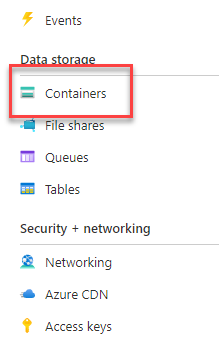
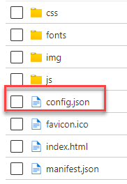

# CSSA-CCW UI Application Local Installation

## How to locate and grab the config.json file content

1. Open the US Government portal [https://portal.azure.us](https://portal.azure.us)
2. Navigate to the Resource Group where you installed CCW
3. Search for the storage account that contains the characters “au” and "pu" for Admin and Public facing storage accounts
4. Select that storage account
5. Select “Containers” from the left-hand Blades

|  |
|-

6. Select the “$web” container

|  |
|-

7. Select the “config.json” file

|  |
|-

8. Select the “Edit” button

|  |
|-

9. Copy the file contents and create the same file in your local environment under respective project's public folder.

> Admin example: `UI/apps/admin/public`
> Public example: `UI/apps/public/public`

> The config.json file found in the root folder of the UI storage container should have the real variables from ADO library.

```json
{
  "Authentication": {
    "ClientId": "#{ClientId}#",
    "AuthorityUrl": "#{AuthorityUrl}#",
    "TenantId": "#{TenantId}#",
    "KnownAuthorities": ["#{KnownAuthorities}#"],
    "PrimaryDomain": "#{PrimaryDomain}#",
    "LoginType": "#{LoginType}"
  },
  "Configuration": {
    "Environment": "#{Environment}#",
    "AdminServicesBaseUrl": "#{AdminServicesBaseUrl}#",
    "ApplicationServicesBaseUrl": "#{ApplicationServicesBaseUrl}#",
    "DocumentServicesBaseUrl": "#{DocumentServicesBaseUrl}#",
    "PaymentServicesBaseUrl": "#{PaymentServicesBaseUrl}#",
    "ScheduleServicesBaseUrl": "#{ScheduleServicesBaseUrl}#",
    "UserProfileServicesBaseUrl": "#{UserProfileServicesBaseUrl}#",
    "Subscription": "#{Subscription}#",
    "DefaultCounty": "#{DefaultCounty}#",
    "DisplayDebugger": "#{DisplayDebugger}#"
  }
}
```

10. Now navigate to [UI Readme file](../../UI/README.MD) and follow the steps to get started on serving the applications on your local server.


